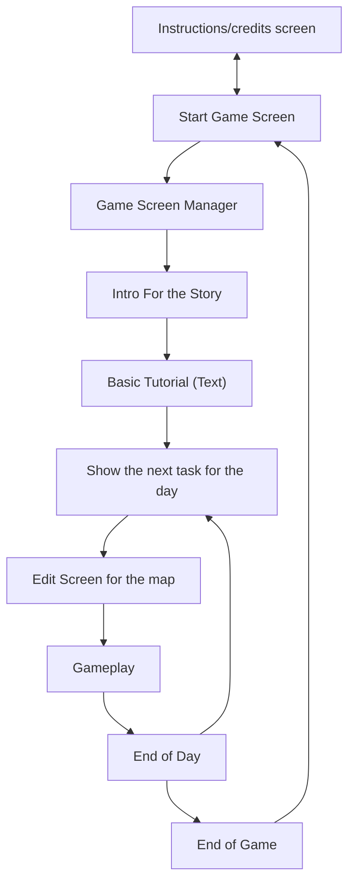

# Game Jam Project Florida Poly Spring 2026

## Tool Used

Godot using C#
AsepriteWizard: Asesprite is needed to import assets

## Diagram of the Game

## Team

- Alexander Ramirez
- Mateus Ramos
- Nicolas Diaz
- Nickolas Diaz
